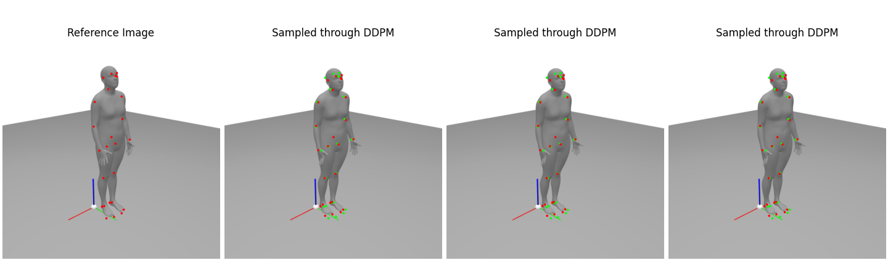
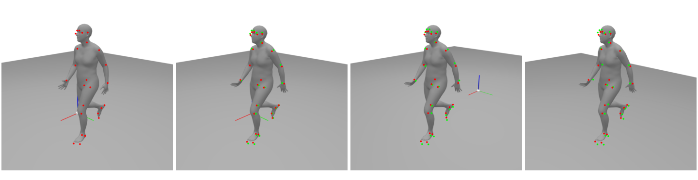

# Diffusion Model for Inverse Problems

Using the Denoising Diffusion Probabilistic Model (DDPM) to solve ill-conditioned inverse problems.

Report: [Learned Optimizer with Diffusion Models](https://apoorv-s.github.io./assets/documents/projectReports/cs236_project_final_report.pdf)

## Example 1: Branin Function

## Example 2: Pose Model

